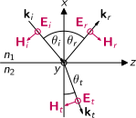
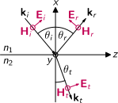
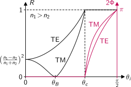

# TE Waves at Material Interfaces

An **s-polarized** wave is polarized perpendicular to the plane of incidence:

{width=886px}

The incident wave $i$ is split into a reflected wave $r$ and a transmitted wave $t$ at the interface. With $k=2\pi/\lambda$, the wave vectors are:
\begin{align*}
\mathbf{k}_i &= n_1 k (-\cos\theta_i, 0, \sin\theta_i) \\
\mathbf{k}_r &= n_1 k ( \cos\theta_r, 0, \sin\theta_r) \\
\mathbf{k}_t &= n_2 k (-\cos\theta_t, 0, \sin\theta_t)
\end{align*}

---

# TE Waves at Material Interfaces (cont.)

When we skip the common phase $\mathrm{e}^{i\omega t}$ and the complex conjugate term, the electric field vectors are given by
\begin{align*}
\mathbf{E}_i &= \hat{\mathbf{y}} E_i\ \mathrm{e}^{ ikn_1 x\cos\theta_i - ikn_1 z\sin\theta_i} \\
\mathbf{E}_r &= \hat{\mathbf{y}} E_r\ \mathrm{e}^{-ikn_1 x\cos\theta_r - ikn_1 z\sin\theta_r} \\
\mathbf{E}_t &= \hat{\mathbf{y}} E_t\ \mathrm{e}^{ ikn_2 x\cos\theta_t - ikn_2 z\sin\theta_t}
\end{align*}
and the magnetic field vectors are
\begin{align*}
\mathbf{H}_i &= -(\hat{\mathbf{x}}\sin\theta_i + \hat{\mathbf{z}}\cos\theta_i) \frac{n_1}{Z_0}E_i\ \mathrm{e}^{ ikn_1 x\cos\theta_i - ikn_1 z\sin\theta_i} \\
\mathbf{H}_r &= -(\hat{\mathbf{x}}\sin\theta_r - \hat{\mathbf{z}}\cos\theta_r) \frac{n_1}{Z_0}E_r\ \mathrm{e}^{-ikn_1 x\cos\theta_r - ikn_1 z\sin\theta_r} \\
\mathbf{H}_t &= -(\hat{\mathbf{x}}\sin\theta_t + \hat{\mathbf{z}}\cos\theta_t) \frac{n_2}{Z_0}E_t\ \mathrm{e}^{ ikn_2 x\cos\theta_t - ikn_2 z\sin\theta_t}
\end{align*}

---

# TE Fresnel Equations

At the material interface $x=0$ the boundary conditions $E_{1\parallel}=E_{2\parallel}$ and $H_{1\parallel}=H_{2\parallel}$ apply, resulting in
\begin{gather*}
E_i \mathrm{e}^{-ikn_1z\sin\theta_i} 
  + E_r \mathrm{e}^{-ikn_1z\sin\theta_r}
  = E_t \mathrm{e}^{-ikn_2z\sin\theta_t} \\
n_1\cos\theta_i E_i \mathrm{e}^{-ikn_1z\sin\theta_i}
  - n_1\cos\theta_r E_r \mathrm{e}^{-ikn_1z\sin\theta_r}
  = n_2\cos\theta_t E_t \mathrm{e}^{-ikn_2z\sin\theta_t}
\end{gather*}
These equations are directly derived from Maxwell's equations and must therefore be valid everywhere for any incident field. This is is only possible if all **phases** are equal:
$$
n_1\sin\theta_i = n_1\sin\theta_r = n_2\sin\theta_t
$$
resulting in
\begin{alignat*}{2}
  \theta_r &= \theta_i &\qquad &\text{law of reflection} \\
  n_1\sin\theta_i &= n_2\sin\theta_t &\qquad &\text{Snell's law}
\end{alignat*}

---

# TE Fresnel Equations (cont.)

For the **amplitudes** the boundary conditions result in
\begin{gather*}
E_i + E_r = E_t \\
n_1\cos\theta_i E_i - n_1\cos\theta_i E_r = n_2\cos\theta_t E_t
\end{gather*}
These equations are used to derive the **Fresnel equations** for TE waves:
\begin{alignat*}{2}
r_E &= \frac{E_r}{E_i} &= \frac{n_1\cos\theta_i - n_2\cos\theta_t}{n_1\cos\theta_i + n_2\cos\theta_t}
  &= -\frac{H_r}{H_i} = -r_H \\
t_E &= \frac{E_t}{E_i} &= \frac{2n_1\cos\theta_i}{n_1\cos\theta_i + n_2\cos\theta_t}
  &= \frac{n_1 H_t}{n_2 H_i} = \frac{n_1}{n_2} t_H
\end{alignat*}
where the impedance relations $E_r/H_r=-n_1/Z_0$ and $E_t/H_t=n_2/Z_0$ lead to the respective Fresnel equations for magnetic fields.

---

# Total Internal Reflection

We use Snell's law $n_1\sin\theta_i=n_2\sin\theta_t$ and the trigonometric identity relation $\sin^2\theta_t+\cos^2\theta_t=1$ to express $\theta_t$ by the given $\theta_i$ in the Fresnel equations:
$$
\cos\theta_t = \pm\sqrt{1-\frac{n_1^2}{n_2^2}\sin^2\theta_i}
$$
For $n_2<n_1$ there is a **critical angle** of incidence $\sin\theta_c=n_2/n_1$ separating the range of real and imaginary values of $\cos\theta_t$:
$$
\cos\theta_t =
\begin{cases}
  +\sqrt{1-\frac{n_1^2}{n_2^2}\sin^2\theta_i} & \text{for } \theta_i<\theta_c \text{ (normal reflection)} \\
  -i\sqrt{\frac{n_1^2}{n_2^2}\sin^2\theta_i-1} & \text{for } \theta_i>\theta_c \text{ (total internal reflection)}
\end{cases}
$$
**Note:** The sign of the square root cannot be decided mathematically. Physical arguments based on the normal phase $\exp(ikn_2x\cos\theta_t)$ are used instead.

---

# Total Internal Reflection (cont.)

In case of total internal reflection, numerator and denominator of $r_E$ are complex conjugates of each other resulting in a pure phase factor with $|r_E|=1$:
\begin{align*}
  r_E = \frac{E_r}{E_i}
  &= \frac{n_1\cos\theta_i+in_2\sqrt{\frac{n_1^2}{n_2^2}\sin^2\theta_i-1}}%
     {n_1\cos\theta_i-in_2\sqrt{\frac{n_1^2}{n_2^2}\sin^2\theta_i-1}} \\
  &= \frac{\left(n_1\cos\theta_i+in_2\sqrt{\frac{n_1^2}{n_2^2}\sin^2\theta_i-1}\right)^2}{n_1^2+n_2^2} 
  \overset{!}{=} \mathrm{e}^{2i\Phi_{TE}}
\end{align*}
Total internal reflection thus comes with a **phase shift** $2\Phi_{TE}$ for the reflected wave with
$$
\tan\Phi_{TE} = \frac{\sqrt{n_1^2\sin^2\theta_i - n_2^2}}{n_1\cos\theta_i}
$$
---

# Poynting Vector

Identity relation from vector analysis applied to electro-magnetic fields:
$$
\boldsymbol{\nabla}(\mathbf{E}\times\mathbf{H})
= \mathbf{H}(\boldsymbol{\nabla}\times\mathbf{E}) - \mathbf{E}(\boldsymbol{\nabla}\times\mathbf{H})
$$
We define the **Poynting vector** $\mathbf{S}=\mathbf{E}\times\mathbf{H}$ with the SI unit $\mathrm{W}/\mathrm{m}^2$ of an energy flux or intensity and we insert Faradays's and Ampère's law:
$$
\boldsymbol{\nabla}\mathbf{S}
= -\mathbf{H}\frac{\partial\mathbf{B}}{\partial t} - \mathbf{j}\mathbf{E} - \mathbf{E}\frac{\partial\mathbf{D}}{\partial t}
$$
Replacing $\mathbf{B}$ and $\mathbf{D}$ by $\mathbf{H}$ and $\mathbf{E}$ we get
$$
\boldsymbol{\nabla}\mathbf{S}
=  -\mathbf{j}\mathbf{E} - \left(\mu\mu_0\mathbf{H}\frac{\partial\mathbf{H}}{\partial t}
+ \varepsilon\varepsilon_0\mathbf{E}\frac{\partial\mathbf{E}}{\partial t}\right)
$$
and finally
$$
\boldsymbol{\nabla}\mathbf{S}
=  -\mathbf{j}\mathbf{E} - \frac{\partial}{\partial t}
\left[\frac12\left(\mu\mu_0\mathbf{H}^2 + \varepsilon\varepsilon_0\mathbf{E}^2\right)\right]
$$

---

# Poynting Vector (cont.)

With the energy density
$$
u = \frac12\left(\mu\mu_0\mathbf{H}^2 + \varepsilon\varepsilon_0\mathbf{E}^2\right)
$$
of the electro-magnetic field with the SI unit $\mathrm{J}/\mathrm{m}^3$ we get the fundamental equation
$$
-\frac{\partial u}{\partial t} = \boldsymbol{\nabla}\mathbf{S} + \mathbf{j}\mathbf{E}
$$
It shows that two effects alter the energy density inside a given volume: Radiation $\boldsymbol{\nabla}\mathbf{S}$ and charge transport by an electric current $\mathbf{j}\mathbf{E}$ through the surface $\partial V$ of the volume:

{width=666px}

---

# Radiation Intensity

Poynting vector of a plane wave:
\begin{align*}
  \mathbf{S} = \mathbf{E}\times\mathbf{H}
  &= \frac12\left(\hat{\mathbf{E}}\,\mathrm{e}^{i(\omega t-\mathbf{k}\mathbf{r})}
  + \hat{\mathbf{E}}^\ast\mathrm{e}^{-i(\omega t-\mathbf{k}\mathbf{r})}\right)
  \times \frac12\left(\hat{\mathbf{H}}\,\mathrm{e}^{i(\omega t-\mathbf{k}\mathbf{r})}
  + \hat{\mathbf{H}}^\ast\mathrm{e}^{-i(\omega t-\mathbf{k}\mathbf{r})}\right) \\
  &= \frac14\left[(\mathbf{E}\times\mathbf{H})\,\mathrm{e}^{2i(\omega t-\mathbf{k}\mathbf{r})}
  + (\mathbf{E}^\ast\times\mathbf{H} + \mathbf{E}\times\mathbf{H}^\ast)
  + (\mathbf{E}^\ast\times\mathbf{H}^\ast)\,\mathrm{e}^{-2i(\omega t-\mathbf{k}\mathbf{r})}\right]
\end{align*}
The radiation **intensity** is defined as absolute value of the temporal average of $\mathbf{S}$:
$$
I = |\langle\mathbf{S}\rangle|
= \frac14 |\mathbf{E}^\ast\times\mathbf{H} + \mathbf{E}\times\mathbf{H}^\ast|
= \frac12 |\Re(\mathbf{E}^\ast\times\mathbf{H})|
$$
and is thus directly connected to the measured radiation power.

---

# Intensity at the Interface

Intensity of the incident, reflected, and transmitted waves normal to the interface:
\begin{alignat*}{2}
  I_i &= \frac12 |\Re(\mathbf{E}_{i\parallel}^\ast\times\mathbf{H}_{i\parallel})|
    &= \frac12 |\Re(E_i^\ast H_i \cos\theta_i)|
    &=  \frac12 |E_i|^2 \frac{n_1}{Z_0} \cos\theta_i \\
  I_r &= \frac12 |\Re(\mathbf{E}_{r\parallel}^\ast\times\mathbf{H}_{r\parallel})|
    &= \frac12 |\Re(E_r^\ast H_r \cos\theta_r)|
    &=  \frac12 |E_r|^2 \frac{n_1}{Z_0} \cos\theta_i \\
  I_t &= \frac12 |\Re(\mathbf{E}_{t\parallel}^\ast\times\mathbf{H}_{t\parallel})|
    &= \frac12 |\Re(E_t^\ast H_t \cos\theta_t)|
    &=  \frac12 |E_t|^2 \frac{n_2}{Z_0} |\Re(\cos\theta_t)|
\end{alignat*}
For **total internal reflection** with $\theta_i>\theta_c$ we have an imaginary $\cos\theta_t$ and thus $I_t=0$:
\begin{align*}
  R &= \frac{I_r}{I_i} = \frac{|E_r|^2}{|E_i|^2} = |r_E|^2
    = \left| \frac{n_1\cos\theta_i - n_2\cos\theta_t}{n_1\cos\theta_i + n_2\cos\theta_t} \right|^2 = 1 \\
  T &= \frac{I_t}{I_i} = 0
\end{align*}

---

# Intensity at the Interface (cont.)

For **normal reflection** with $\theta_i<\theta_c$ we obtain
\begin{align*}
  R &= \frac{I_r}{I_i} = \frac{|E_r|^2}{|E_i|^2}
    = \left| \frac{n_1\cos\theta_i - n_2\cos\theta_t}{n_1\cos\theta_i + n_2\cos\theta_t} \right|^2 \\
  T &= \frac{I_t}{I_i} = \frac{n_2\cos\theta_t}{n_1\cos\theta_i}\,\frac{|E_t|^2}{|E_i|^2}
    = \frac{n_1n_2\cos\theta_i\cos\theta_t}{(n_1\cos\theta_i + n_2\cos\theta_t)^2}
\end{align*}
with $R+T=1$, and in case of normal incidence with $\theta_i=0$ the reflection factor reduces to
$$
R = \left(\frac{n_1-n_2}{n_1+n_2}\right)^2
$$

---

# TM Waves at Material Interfaces

An **p-polarized** wave is polarized parallel to the plane of incidence:

{width=886px}

The incident wave $i$ is split into a reflected wave $r$ and a transmitted wave $t$ at the interface in exactly the same way as for the TE wave:
\begin{align*}
\mathbf{k}_i &= n_1 k (-\cos\theta_i, 0, \sin\theta_i) \\
\mathbf{k}_r &= n_1 k ( \cos\theta_r, 0, \sin\theta_r) \\
\mathbf{k}_t &= n_2 k (-\cos\theta_t, 0, \sin\theta_t)
\end{align*}

---

# TM Waves at Material Interfaces (cont.)

When we skip the common phase $\mathrm{e}^{i\omega t}$ and the complex conjugate term, the electric field vectors are given by
\begin{align*}
\mathbf{E}_i &= (\hat{\mathbf{x}}\sin\theta_i + \hat{\mathbf{z}}\cos\theta_i) E_i\ \mathrm{e}^{ ikn_1 x\cos\theta_i - ikn_1 z\sin\theta_i} \\
\mathbf{E}_r &= (\hat{\mathbf{x}}\sin\theta_r - \hat{\mathbf{z}}\cos\theta_r) E_r\ \mathrm{e}^{-ikn_1 x\cos\theta_r - ikn_1 z\sin\theta_r} \\
\mathbf{E}_t &= (\hat{\mathbf{x}}\sin\theta_t + \hat{\mathbf{z}}\cos\theta_t) E_t\ \mathrm{e}^{ ikn_2 x\cos\theta_t - ikn_2 z\sin\theta_t}
\end{align*}
and the magnetic field vectors are
\begin{align*}
\mathbf{H}_i &= \hat{\mathbf{y}}\frac{n_1}{Z_0}E_i\ \mathrm{e}^{ ikn_1 x\cos\theta_i - ikn_1 z\sin\theta_i} \\
\mathbf{H}_r &= \hat{\mathbf{y}}\frac{n_1}{Z_0}E_r\ \mathrm{e}^{-ikn_1 x\cos\theta_r - ikn_1 z\sin\theta_r} \\
\mathbf{H}_t &= \hat{\mathbf{y}}\frac{n_2}{Z_0}E_t\ \mathrm{e}^{ ikn_2 x\cos\theta_t - ikn_2 z\sin\theta_t}
\end{align*}

---

# TM Fresnel Equations

With the boundary conditions $E_{1\parallel}=E_{2\parallel}$ and $H_{1\parallel}=H_{2\parallel}$ at $x=0$, we get
\begin{gather*}
\cos\theta_i E_i \mathrm{e}^{-ikn_1z\sin\theta_i} 
  - \cos\theta_r E_r \mathrm{e}^{-ikn_1z\sin\theta_r}
  = \cos\theta_t E_t \mathrm{e}^{-ikn_2z\sin\theta_t} \\
n_1 E_i \mathrm{e}^{-ikn_1z\sin\theta_i}
  + n_1 E_r \mathrm{e}^{-ikn_1z\sin\theta_r}
  = n_2 E_t \mathrm{e}^{-ikn_2z\sin\theta_t}
\end{gather*}
The phases must be equal again, resulting in the law of reflection and Snell's law again.
\begin{gather*}
\cos\theta_i E_i - \cos\theta_i E_r = \cos\theta_t E_t \\
n_1 E_i + n_1 E_r = n_2 E_t
\end{gather*}
These equations are used to derive the **Fresnel equations** for TM waves:
\begin{alignat*}{2}
r_E &= \frac{E_r}{E_i} &= \frac{n_2\cos\theta_i - n_1\cos\theta_t}{n_2\cos\theta_i + n_1\cos\theta_t}
  &= -\frac{H_r}{H_i} = -r_H \\
t_E &= \frac{E_t}{E_i} &= \frac{2n_1\cos\theta_i}{n_2\cos\theta_i + n_1\cos\theta_t}
  &= \frac{n_1 H_t}{n_2 H_i} = \frac{n_1}{n_2} t_H
\end{alignat*}

---

# Total Internal Reflection

The critical angle for total internal reflection is the same for TM waves.
Numerator and denominator of $r_E$ are again complex conjugates of each other:
\begin{align*}
  r_E = \frac{E_r}{E_i}
  &= \frac{n_2\cos\theta_i+in_1\sqrt{\frac{n_1^2}{n_2^2}\sin^2\theta_i-1}}%
     {n_2\cos\theta_i-in_1\sqrt{\frac{n_1^2}{n_2^2}\sin^2\theta_i-1}} \\
  &= \frac{\left(n_2\cos\theta_i+in_1\sqrt{\frac{n_1^2}{n_2^2}\sin^2\theta_i-1}\right)^2}%
    {n_2^2\cos^2\theta_i + \frac{n_1^2}{n_2^2} (n_1^2\sin^2\theta_i-n_2^2)} 
  \overset{!}{=} \mathrm{e}^{2i\Phi_{TM}}
\end{align*}
The **phase shift** $2\Phi_{TM}$ for the reflected wave in case of total internal reflection thus is
$$
\tan\Phi_{TM} = \frac{n_1^2}{n_2^2} \frac{\sqrt{n_1^2\sin^2\theta_i - n_2^2}}{n_1\cos\theta_i}
= \frac{n_1^2}{n_2^2} \tan\Phi_{TE}
$$

---

# Brewster Angle

Fresnel's equations for TM waves allow for a certain angle of incidence $\theta_i=\theta_B$ with vanishing reflection $r_E(\theta_B)=0$:
\begin{align*}
n_2\cos\theta_B &= n_1\sqrt{1-\frac{n_1^2}{n_2^2}\sin^2\theta_B} \\
\frac{n_2^2}{n_1^2}\cos^2\theta_B &= 1-\frac{n_1^2}{n_2^2}\sin^2\theta_B
\end{align*}
We use the trigonometric identity $\sin^2\theta_B+\cos^2\theta_B=1$ and collect the $\sin^2\theta_B$ terms on the left side of the equation:
\begin{align*}
\left(\frac{n_1^2}{n_2^2} - \frac{n_2^2}{n_1^2}\right) \sin^2\theta_B &= 1 - \frac{n_2^2}{n_1^2} \\
\frac{n_1^4-n_2^4}{n_1^2 n_2^2} \sin^2\theta_B &= \frac{n_1^2-n_2^2}{n_1^2}
\end{align*}

---

# Brewster Angle (cont.)

Using the identity $n_1^4-n_2^4 = (n_1^2+n_2^2)(n_1^2-n_2^2)$ and expressing $\sin^2\theta_B$ by $\tan^2\theta_B$ results in
\begin{align*}
\sin^2\theta_B &= \frac{n_2^2}{n_1^2+n_2^2} \\
\frac{\tan^2\theta_B}{1+\tan^2\theta_B} &= \frac{n_2^2/n_1^2}{1+n_2^2/n_1^2}
\end{align*}
A comparison of both sides reveals the final expression for the **Brewster angle**:
$$
\tan\theta_B = \frac{n_2}{n_1}
$$
Note that a Brewster angle exists only for p-polarisation.

---

# Power Reflection Diagram

**Summary:** Power reflection factor and phase shift for the reflection of an electro-magnetic wave at a material with lower or higher refractive index.

{width=1560px}\hspace{3em}{width=1068px}
