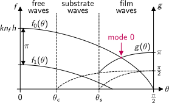
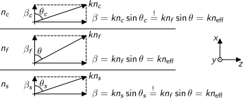

# Film Waveguides

Waveguiding requires at least two interfaces.
The film waveguide with two parallel interfaces consisting of three material layers **substrate**, **film** and **cladding** is the simplest kind of dielectric waveguide.
Utilisation of total internal reflection requires the highest refractive index for the film layer.
We denote the other layers according to 
$$
n_f > n_s \geq n_c
$$

The range of propagation angles $\theta$ in the film splits into three cases.
Small angles result in normal reflection at both interfaces.
This is called **free wave**:

{width=1640px}

---

# Film Waveguides (cont.)

If substrate and cladding have different refractive indices, intermediate angles can result in total internal reflection at the cladding only.
This is called **substrate wave**:

{width=1640px}

Waveguiding requires total internal reflection at both interfaces.
The **film wave** is trapped between both interfaces.
It can enter and leave the film only via its end faces:

{width=1640px}

---

# Reflected Wave

For each guided wave with wave vector $\mathbf{k}^+=k(\cos\theta,0,\sin\theta)$ there is also its reflected counterpart with wave vector $\mathbf{k}^-=k(-\cos\theta,0,\sin\theta)$:

{width=1623px}

With $\mathbf{r}=(x,y,z)$ the expressions for these two waves are
$$
\mathbf{E}^\pm(t,\mathbf{r})
= \hat{\mathbf{E}}\, \mathrm{e}^{i (\omega t - n_f \mathbf{k}^\pm\mathbf{r})}
= \hat{\mathbf{E}}\, \mathrm{e}^{i [\omega t - kn_f (\pm x \cos\theta + z \sin\theta)]}
$$

---

# Standing Wave

The superposition of both waves results in a sum wave **standing** in $x$-direction and **travelling** in $z$-direction along the waveguide:
\begin{align*}
\mathbf{E}(t,\mathbf{r}) 
&= \mathbf{E}^+(t,\mathbf{r}) + \mathbf{E}^-(t,\mathbf{r}) \\
&= \hat{\mathbf{E}} \left[
\mathrm{e}^{i[\omega t - kn_f (-x\cos\theta + z\sin\theta)]} + \mathrm{e}^{i[\omega t - kn_f (x\cos\theta + z\sin\theta)]}
\right] \\
&= \hat{\mathbf{E}} \left(\mathrm{e}^{i kn_f x\cos\theta} + \mathrm{e}^{-i kn_f x\cos\theta}\right)
\mathrm{e}^{i(\omega t - kn_f z \sin\theta)} \\
&= 2\, \hat{\mathbf{E}} \cos(kn_f x \cos\theta)\,\mathrm{e}^{i(\omega t - \beta z)}
\end{align*}
with $\beta=kn_\text{eff}$ and the **effective refractive index** $n_\text{eff}=n_f\sin\theta$ of the propagation in $z$-direction.
The value of this effective refractive index always lies between the film and the surrounding materials:
$$
n_f \geq n_\text{eff} \geq n_s \geq n_c
$$

---

# Characteristic Equation

Note: The derivation requires **constructive interference** of both waves.
The phase delay of a full round trip in $x$-direction must sum up to an integer multiple of $2\pi$:
$$
k n_f h \cos\theta - 2\Phi_c(\theta) + k n_f h \cos\theta - 2\Phi_s(\theta) = m\,2\pi
\qquad \text{with } m = 0,1,2,\ldots
$$
The propagation angle $\theta$ of a guided wave must satisfy the **characteristic equation**
$$
k n_f h \cos\theta - \Phi_c(\theta) - \Phi_s(\theta) = m\pi
$$
with the polarisation dependent phase shifts of total internal reflection
$$
\text{TE: }
\tan\Phi_i(\theta) = \sqrt{\frac{n_\text{eff}^2(\theta)-n_i^2}{n_f^2-n_\text{eff}^2}}
\qquad\text{TM: }
\tan\Phi_i(\theta) = \frac{n_f^2}{n_i^2} \sqrt{\frac{n_\text{eff}^2(\theta)-n_i^2}{n_f^2-n_\text{eff}^2}}
$$
with $i\in[s,c]$. Such guided waves are called **transversal waveguide modes**.

---

# Waveguide Modes

There exists no analytical solution of the characteristic equation.
For a graphical solution we split it into two functions $f_m(\theta)=kn_fh\cos\theta- m\pi$ and $g(\theta)=\Phi_s(\theta)+\Phi_c(\theta)$.
Guided modes thus correspond to intersections of both functions:

{width=1644px}

with the critical angles $\sin\theta_c = n_c/n_f$ and $\sin\theta_s = n_s/n_f$. 

---

# Special Cases

**Symmetric waveguides** with $n_c=n_s$ are always guiding at least one mode:

{width=2154px}

For thick films with $h\gg\lambda$ the function $f_m(\theta)$ becomes very steep, resulting in many intersections.
Such waveguides are called **multimode waveguides**.

---

# Universal Solution

The $V$-number as dimensionless **frequency parameter** combines the external input parameters of geometry($h$), material ($NA$) and signal ($\lambda$) using the definition of the numerical aperture $NA=\sqrt{n_f^2-n_s^2}$:
$$
V = k h \sqrt{n_f^2-n_s^2} = 2\pi \frac{h}{\lambda} NA
\in [0,\infty]
$$
The **asymmetry parameter** $\alpha$ is zero for symmetric waveguides with $n_c=n_s$. For TE modes it is given by:
$$
\alpha_{TE} = \frac{n_s^2 - n_c^2}{n_f^2-n_s^2}
\in [0,\infty]
$$
The **phase parameter** $B_m$ describes a waveguide mode $m$ based on the propagation angle $\theta_m$ as output parameter:
$$
B_m = \frac{n_\text{eff}^2-n_s^2}{n_f^2-n_s^2}
= \frac{n_f^2\sin^2\theta_m-n_s^2}{n_f^2-n_s^2}
\in [0,1]
$$

---

# Universal Solution (cont.)

With these definitions, the terms of the characteristic equation translate to:
$$
k n_f h \cos\theta_m = V \sqrt{1-B_m}
\qquad
\tan\Phi_{s,TE} = \sqrt{\frac{B_m}{1-B_m}}
\qquad
\tan\Phi_{c,TE} = \sqrt{\frac{B_m + \alpha_{TE}}{1-B_m}}
$$
The universal characteristic equation is thus
$$
V(B_m) = \frac{1}{\sqrt{1-B_m}}
\left(m\pi + \arctan\sqrt{\frac{B_m}{1-B_m}} + \arctan\sqrt{\frac{B_m + \alpha_{TE}}{1-B_m}}\right)
$$
There again exists no analytical solution, but $V$ is a monotonous function of $B_m$ and has certain properties, which make a numerical inversion simple and straight forward.
This is used to determine the phase parameter for each mode.

---

# Numerical Algorithm

We start with the calculation of the $V$-number based on the parameters of the waveguide.
Its value determines the number of modes.
For each mode $m$ the phase parameter $B_m$ between 0 and 1 is found using the bisection method on the monotonous function $V(B_m)$.
Finally, the mode angle $\theta_m$ is directly calculated from $B_m$.

{width=2114px}

---

# Number of Modes

For each mode $m$ the curve starts at a certain point $V_m$, which determines the number of modes for a given $V$-number:
$$
V_m = V|_{B_m=0} = m \pi + \arctan \sqrt{\alpha_{TE}}
$$

Taking into account that each TE mode comes with a respective TM mode, this **number of modes** $N$ is two times the first integer above $V/\pi$ in case of a symmetric waveguide with $\alpha_{TE}=0$:
$$
N = 2\,\text{ceil} \left(\frac{V}{\pi}\right)
= 2\,\text{ceil} \left(\frac{2h}{\lambda}\sqrt{n_f^2-n_s^2}\right)
$$

---

# Cut-Off Wavelength

For a given waveguide and a given mode number $m$ there exists a **cut-off wavelength** $\lambda_m$, which is the largest signal wavelength allowed for mode $m$ to exist:
\begin{gather*}
2\pi \frac{h}{\lambda_m} \sqrt{n_f^2-n_s^2} = m\pi \\
\lambda_m = \frac{2h}{m} \sqrt{n_f^2-n_s^2}
\end{gather*}

In particular, this means that a given waveguide is **single-mode** for signal wavelengths $\lambda > \lambda_1$ and the the same waveguide is **multimode** for $\lambda < \lambda_1$.

---

# Wave Vectors

The component $\beta$ of the wave vector in the direction of the waveguide is the same in all three layers, due to Snell's law:

{width=2091px}

---

# Wave Vectors (cont.)

The component $\beta_i$ perpendicular to the interfaces with $i\in[s,f,c]$ can be calculated using Pythagoras' theorem:
$$
\beta_i = \sqrt{n_i^2k^2 - \beta^2} = k\sqrt{n_i^2 - n_f^2\sin^2\theta}
$$
It is related to the **spatial period** $\Lambda_i$ of the lateral mode shape by $\beta_i =2\pi/\Lambda_i$.
In case of total internal reflection, the square root is imaginary in the substrate and/or cladding:
$$
\alpha_i = ik\sqrt{n_f^2\sin^2\theta - n_i^2}
$$
and the mode shape follows an exponential decay instead of a spatial oscillation.
This tail of the mode protruding into the substrate and/or cladding is called **evanescent field**.

---

# Mode Shapes

The lateral shape of the waveguide modes consists of piecewise defined sine and/or exponential functions.
The shape as well as its first derivative is continuous at both interfaces.
These conditions are fixing the lateral phase offsets in each layer.

{width=2110px}

---

# Summary of Mode Calculations

- The **initial parameters** $h$, $n_s$, $n_f$, $n_c$, $\lambda$, and $E_f$ are given by the waveguide design and the experimental conditions.

- Fresnel equations determine the amplitudes $E_s$ and $E_c$.

- Solving the characteristic equation provides the number of modes $N$ as well as their propagation angles $\theta_m$.

- The propagation angles determine the lateral wave numbers $\beta_i$ or exponential decay parameters $\alpha_i$.

- Based on the previous results the continuity conditions at the interfaces deliver the lateral phase offset in each material layer.

- **Result:** Completely defined shape and propagation parameters for all guided and unguided modes.
