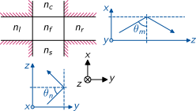
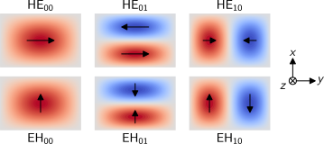
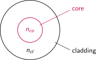
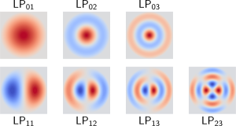

# Rectangular Waveguides

The weakly guiding approximation can be applied to a waveguide with rectangular cross section if the refractive index contrast in the waveguide structure is low.
In this case the waveguide modes are the $N \times M$ combinations of the modes of two independent crossing film waveguides.

{width=1470px}

We have evanescent fields from both directions in the four corners of the structure.
The fields are thus approximated to be zero there.

---

# Rectangular Modes

A $y$-polarised mode of a rectangular waveguide is the combination of a horizontal TE mode with mode number $m$ and a vertical TM mode with mode number $n$.
This is called $\text{HE}_{mn}$ mode.
In case of $x$-polarisation, the horizontal mode is TM and the vertical TE, resulting in a rectangular $\text{EH}_{mn}$ mode.

{width=2124px}

---

# Typical Planar Waveguides

**Strip waveguides** are fabricated using lithography on a film layer:

{width=626px}

**Burried waveguides** are produced using implant or laser writing processes:

{width=626px}

**Rib waveguides** are made from a single substrate material using lithography:

{width=626px}

---

# Optical Fibres

The mathematical description of circular waveguides requires to switch from the Cartesian coordinate system $(x,y,z)$ to a cylindrical coordinate system $(r,\phi,z)$.
Analytic solutions exist for step index fibres consisting of a core with refractive index $n_{co}$ and radius $r_{co}$ surrounded by a cladding with lower index $n_{cl}$.

{width=1141px}

---

# Bessel Functions

The transformation from Cartesian coordinates into cylindrical coordinates transforms the wave equation into the Bessel equation.

While sine and cosine functions are the natural solutions to the wave equation, the corresponding solutions to the Bessel equation are Bessel functions of first and second kind $J_\alpha$ and $Y_\alpha$.
The former is finite at the origin ($r=0$), while the later has a pole at the origin.
In contrast to the periodic sine and cosine functions, Bessel functions are oscillating, but not with a fixed period.
The equivalent to the phase shift of sine and cosine are orders $\alpha$ of Bessel functions.

Imaginary arguments transform sine and cosine to exponential functions.
In the same way are Bessel functions transformed into modified Bessel functions $I_\alpha$ and $K_\alpha$, without oscillation and with similar shape as exponential functions.

For more details and diagrams, see [Wikipedia](https://en.wikipedia.org/wiki/Bessel_function).

---

# Fibre Modes

The modes of optical fibres are usually classified in the $\text{LP}_{lm}$ scheme, with the angular mode number $l$ and the radial mode number $m$.
Inside the **core**, the transversal mode fields follow the following function
$$
\hat{\mathbf{E}}_{lm}(r,\phi) \propto \cos(l\phi)\, J_l\left(U_m\frac{r}{r_{co}}\right)
$$
with the Bessel function of the first kind $J_l$ and the fibre parameter $U_m=r_{co}\sqrt{k^2n_{co}^2-\beta_m^2}$. The evanescent field of a guided mode in the **cladding** follows the function
$$
\hat{\mathbf{E}}_{lm}(r,\phi) \propto \cos(l\phi)\, K_l\left(W_m\frac{r}{r_{co}}\right)
$$
with the modified Bessel function of the second kind $K_l$ and $W_m=r_{co}\sqrt{\beta_m^2-k^2n_{cl}^2}$.

**Note:** The fibre parameters $U$ and $W$ are linked to the V-number by $V^2=U_m^2+W_m^2$.

---

# Fibre Modes (cont.)

Some field profiles clarify the angular and radial behaviour of guided $\text{LP}_{lm}$ fibre modes:

{width=1771px}

**Note:** Bessel functions of the first kind are oscillating, but they are not periodic.
Note also that LP modes are not linearly polarised for $l>0$.
