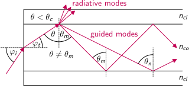
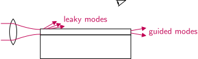
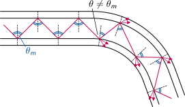
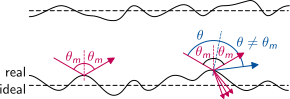
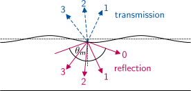
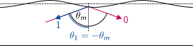

# Generalised Modes

So far we discussed the special case of waveguides containing a film or a core with increased refractive index.
We generalise the situation now to an **arbitrary lateral distribution** of the refractive index $n(x,y)$, which is constant along an optical axis $z$.

Modes are the solution of Maxwell's equations for such a structure. There may be set of discrete guided modes and/or a continuous range of unguided radiation modes. All modes of a certain structure together form a **complete set of orthonormal base functions** for transversal electric or magnetic fields.

Every wave propagating along the optical axis can be uniquely expressed as a **linear superposition** of these modes with constant coefficients.

Modes for arbitrary lateral refractive index distributions are calculated numerically using **Maxwell solver** libraries. Besides a proper discretisation, the definition of reasonable boundary conditions is key to obtain correct results.

---

# Normalising Modes

The power of the transversal fields $\mathbf{E}_{tm}$ and $\mathbf{H}_{tm}$ of the mode $m$ of a waveguide structure is
$$
P_m = \frac14 \int\limits_{-\infty}^{+\infty} |\mathbf{E}_{tm}^\ast \times \mathbf{H}_{tm} + \mathbf{E}_{tm} \times \mathbf{H}_{tm}^\ast|\, dx\,dy
$$
Note that the transversal components of the cross product are zero. Therefore, the magnitude delivers the component in the propagation direction, which is $z$ in the standard coordinate system. We define normalized mode profiles by
$$
\hat{\mathbf{E}}_{tm}=\frac{\mathbf{E}_{tm}}{\sqrt{P_m}} \qquad
\hat{\mathbf{H}}_{tm}=\frac{\mathbf{H}_{tm}}{\sqrt{P_m}}
$$

---

# Mode Expansion

An arbitrary transversal field $\mathbf{E}_t$ can be uniquely expressed as a linear combination of modes:
$$
\mathbf{E}_t(x,y,z)
= \sum\limits_m a_m(z)\, \hat{\mathbf{E}}_{tm}(x,y) 
+ \int\! a(\mu, z)\, \hat{\mathbf{E}}_t(\mu, x, y) d\mu
$$
with weight factors $a_m$ for discrete guided modes and the weight spectrum $a(\mu)$ for continuous unguided modes. The mode number $m$ is actually a tuple of integers in case of two-dimensional waveguides and the continuous mode number $\mu$ covers the whole range of wave vectors leading to normal reflection at one interface at least. The weight factors are given by
$$
a_m = \frac14 \int\limits_{-\infty}^{+\infty} |\mathbf{E}_{t}^\ast \times \hat{\mathbf{H}}_{tm} + \mathbf{E}_{t} \times \hat{\mathbf{H}}_{tm}^\ast|\, dx\,dy
$$
which means that $|a_m|^2$ is the power of mode $m$.

---

# Numerical Calculation

Discretisation converts the continuous superposition integral into a sum over discrete mode numbers. However, the amount of radiation mode numbers depends on the details of the discretisation in contrast to the situation for guided modes.

Every mode comes in two flavours: A forward propagating wave with **positive** mode number $m$ and a backward propagating wave with **negative** mode number $-m$.

The magnitude of the weight factors is the same for the expansion of electric and magnetic fields. Only the sign for backward propagating magnetic modes is flipped:
\begin{align*}
\mathbf{E}_t(x,y,z) &= \sum_{m>0} \left[a_m(z) + a_{-m}(z)\right] \hat{\mathbf{E}}_{tm} (x,y) \\
\mathbf{H}_t(x,y,z) &= \sum_{m>0} \left[a_m(z) - a_{-m}(z)\right] \hat{\mathbf{H}}_{tm} (x,y)
\end{align*}
**Note:** Each mode travels with a different speed, the total field shape is no constant.

---

# End Face Incoupling

A wave is coupled into a waveguide with external incident angle $\varphi_i$ at its end face.
The internal wave is propagating at an angle $\theta = 90^\circ-\varphi_t$ resulting from Snell's law.
If $\theta$ does not match a guided mode angle $\theta_m$ exactly,
mode expansion of the internal wave will result in power loss via radiative leaky modes as well as partial propagation in other guided modes $\theta_n$.

{width=1895px}

**Note:** For $\theta=\theta_c$, we have $\sin\varphi_i=\sqrt{n_{co}^2-n_{cl}^2}=NA$.

---

# Coupling Losses

A perfect match of an external field to a guided mode field is impossible.
Therefore, the coupling of light into an optical waveguide always leads to some loss via leaky radiation modes.
These losses are clearly visible near the input end face if you look against the beam direction at a flat angle along the waveguide.
Further along the waveguide there are only guided modes left, which do not leave the waveguide in lateral direction.

{width=1922px}

---

# Curvature Losses

When a guided wave hits the interface at a curvature of the waveguide, the local angle of incidence does not match the mode angle any more.
This leads to significant radiative losses in case of a small radius of curvature.

{width=1606px}

In practice this effect is used to extract or insert signals from and to active optical fibres without physical damage
for the maintenance of fibre networks or for espionage.

---

# Interface Deformation

A real material interface will deviate from an ideal flat one at least on the microscopic scale.
The local scope of the law of reflection in this situation leads to unguided variations of the propagation angle of the wave.
This effect results in **losses and mode conversion**.

{width=1717px}

---

# Periodic Modulation

A periodic modulation of an material interface resembles an **optical grating**.
It results in constructive interference of the reflected waves in certain diffraction orders.
The directions depend only on the period of the modulation, not on the waveguide properties.
The shape of the modulation profile determines the strength of each diffraction order.

{width=1630px}

Such modulated waveguide interfaces are used to **couple radiation** into the waveguide or from the waveguide in lateral direction.

---

# Distributed Feedback (DFB)

A special case of periodic interface modulation is used in DFB structures.
The grating constant is selected such that the angle of the first diffraction order matches the mode angle $\theta_1=-\theta_m$.
For each modulation period a fraction of the forward travelling guided mode is reflected into its backward travelling counterpart.
The length of the grating structure determines the total distributed reflection factor.

{width=1630px}

Such DFB structures are used in transversal single mode **laser diodes** to select also a single longitudinal laser mode and thus minimise the spectral bandwidth of the laser.
