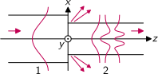
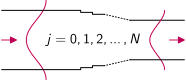
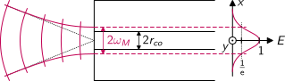
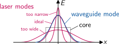
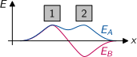
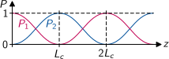
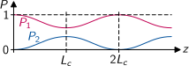
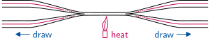
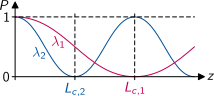
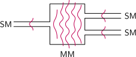

# Axial Waveguide Coupling

The simplest approach to transfer an optical signal from one waveguide 1 to another waveguide 2 with different geometry and/or material properties is butt-coupling of both waveguides:

{width=1174px}

Mode expansion of the incident field at the end face of waveguide 2 reveals that even a single mode from waveguide 1 is distributed over the whole mode spectrum of waveguide 2 in general.
This inevitably leads to losses via radiation modes.

**Note:** For the coupling efficiency between a certain pair of modes it doesn't matter which of the two waveguides has the larger core. 

---

# Taper Coupling

We demonstrate a more efficient coupling approach using a **simplified case** for the coupling of two single mode film waveguides.
The power $P_1$ carried in waveguide 1 is coupled to power $P_2=\eta P_1$ in waveguide 2 with the coupling efficiency
$$
\eta = \frac{\left|
\int\! n_2\,E_1 E_2^\ast dx\right|^2}{
\int\! n_2\,E_1 E_1^\ast dx \cdot
\int\! n_2\,E_2 E_2^\ast dx} 
$$
For the two modes we assume a Gaussian field distribution $E_j=E_{m,j}\,\mathrm{e}^{-x^2/\omega_j^2}$.
When we ignore the integration over the evanescent field in the cladding, index distributions $n_2(x)$ become constants, which cancel out.
We get a **symmetric** expression for the efficiency:
$$
\eta = \frac{\left|
\int\! \exp\left[-x^2\left(\frac{1}{\omega_1^2}+\frac{1}{\omega_2^2}\right)\right]dx\right|^2}{
\int\! \exp\left(\frac{-2x^2}{\omega_1^2}\right)dx \cdot
\int\! \exp\left(\frac{-2x^2}{\omega_2^2}\right)dx}
= \frac{2\omega_1\omega_2}{\omega_1^2+\omega_2^2}
= \left[\frac12\left(\frac{\omega_1}{\omega_2}+\frac{\omega_2}{\omega_1}\right)\right]^{-1}
$$

---

# Taper Coupling (cont.)

Instead of a single large step, we now build a coupling section made of a number of smaller steps consisting of waveguide segments 0 to $N$.
The geometry of the intermediate steps is designed such that we have $\omega_j=\omega_0\exp(-j\Delta\omega)$ with $\Delta\omega=\ln(\omega_0/\omega_N)/N$. 

{width=1099px}

The coupling efficiency for the small step between two consecutive segments is
$$
\eta_{j,j+1} = \left[\frac12 \left(\mathrm{e}^{\Delta\omega} + \mathrm{e}^{-\Delta\omega}\right)\right]^{-1} = \cosh^{-1}(\Delta\omega)
$$

---

# Taper Coupling (cont.)

When we skip one intermediate segment, the coupling efficiency for the larger step to the segment after the next is
$$
\eta_{j,j+2} = \left[\frac12 \left(\mathrm{e}^{2\Delta\omega} + \mathrm{e}^{-2\Delta\omega}\right)\right]^{-1} = \cosh^{-1}(2\Delta\omega)
$$
It turns out that the efficiency of two smaller steps is larger than that of one larger step
$$
\frac{\eta_{j,j+1} \cdot \eta_{j+1,j+2}}{\eta_{j,j+2}} = \frac{\cosh(2\Delta\omega)}{\cosh^2(\Delta\omega)} > 1
$$
and infinitely small steps result in a lossless transition between the two waveguide modes:
$$
\lim_{N\to\infty} \eta_{0,N}
= \lim_{N\to\infty} \frac{P_N}{P_0}
= \lim_{N\to\infty} \frac{1}{\cosh^N \left(\frac{\ln(\omega_0/\omega_N)}{N}\right)}
= 1
$$
**Note:** Such an **adiabatic taper** is lossless for one pair of modes only.

---

# Laser Coupling

The fundamental mode of a laser with free space resonator usually has a Gaussian beam profile
with the magnitude
$$
E_0(x,y) = E_m\,\mathrm{e}^{-\frac{x^2+y^2}{\omega_M^2}}
$$
and the so called beam radius $\omega_M$ defined by the field reduction to $1/\mathrm{e}\approx37\%$.
This profile fits very well to the fundamental mode profile of quadratic or circular step-index waveguides.

{width=1886px}

---

# Laser Coupling (cont.)

The coupling efficiency from the field $E_0$ of the laser beam to the field $E_1$ of the fundamental waveguide mode is given by the respective normalised weight factor from the mode decomposition procedure:
$$
\eta = \frac{\left|
\int\! n\,E_0 E_1^\ast dxdy\right|^2}{
\int\! n\,E_0 E_0^\ast dxdy \cdot
\int\! n\,E_1 E_1^\ast dxdy} 
$$
The better the overlap of $E_0$ and $E_1$, the higher is the efficiency.
For the optimum $E_0=E_1$ it reaches $100\%$.
Note also its symmetry.
For the efficiency it does not matter whether the laser or the waveguide mode is the wider one:

{width=1418px}

---

# Laser Coupling (cont.)

The radius of a Gaussian beam as function of the distance $z$ from its focus point is
$$
\omega(z) = \omega_0 \sqrt{1+\left(\frac{z}{z_R}\right)^2}
$$
with the Rayleigh length $z_R=\pi\omega_0^2/\lambda$. This equation can be used to determine the focus diameter $\omega_0$ when a laser beam with diameter $\omega=\omega_L$ is focussed on the end face of a waveguide using a lens with focal length $z=f$. The coupling losses to the fundamental mode of a step-index fibre are minimised, when $2\omega_0$ is equal to the mode field diameter of the fibre. For a weakly-guiding step-index fibre this condition is
$$
MFD = 2r_{co} \left(0.65 + \frac{1.619}{V^{1.5}} + \frac{2.879}{V^6}\right) \overset{!}{=} 2\omega_0
$$
with the $V$-number
$$
V = \frac{2\pi r_{co}}{\lambda}NA
$$

---

# Lateral Coupling

Two waveguide cores 1 and 2 in close proximity with overlapping individual mode fields

{width=1012px}

exhibit a common symmetric fundamental mode A and antisymmetric mode B:

{width=1012px}

If we feed light in core 1 only, we excite the wave $\frac12(E_A+E_B)$, which is almost identical to $E_1$, while $\frac12(E_A-E_B)$ describes a wave travelling in core 2 only, resembling $E_2$.

---

# Lateral Coupling (cont.)

Due to the different phase velocity of $E_A$ and $E_B$, light coupled into one core ($E_1$) oscillates between both cores along the structure in $z$ direction. At a distance called the **coupling length** $L_c$, the wave has completely crossed over to the second core ($E_2$):

{width=1269px}

Such a device with identical cores is called a symmetric **directional coupler**. It can be fabricated for any coupling ratio depending on its length. In an asymmetric coupler the wave is oscillating as well, but not coupling completely:

{width=1269px}

---

# Fibre Coupler

For the fabrication of fibre couplers, two optical fibres are aligned in parallel, touching each other.
The fibres are heated in the centre and pulled axially:

{width=1778px}

In this process the fibres melt together and form tapers with a thin bone-shaped cross-section in the centre:

{width=1507px}

In the taper section, the fibre core is reduced so much that the cladding takes over the role of the guiding core.

---

# Wavelength Coupler

The coupling length depends on the overlap between the two individual core modes.
For larger wavelengths $\lambda_2>\lambda_1$ the mode diameter of a waveguide increases.
Therefore, the coupling becomes stronger and the coupling length decreases: $L_{c,2}<L_{c,1}$.

{width=1269px}

A coupler with $L_{c,1}=2L_{c,2}$ is called a **wavelength division multiplexer** (WDM).
It is used to multiplex two signals with different wavelengths into a single fibre
or to demultiplex two signals from one fibre into two.

---

# Multimode Interference Coupler

Directional couplers with short coupling length require a very small gap between the two cores for a strong coupling.
While this is not critical for fibre couplers, it is a problem in planar integrated optics where it demands for extreme lithography resolution.

A better solution in integrated optics are therefore multimode interference (MMI) couplers.
They use the known propagation characteristics of an optical signal from a single-mode waveguide coupled into a multimode section:

{width=1332px}

**Note:** Even though the mode coefficients are fixed inside the MM-section, the field is changing due to the different mode velocities.