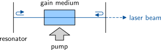
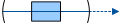
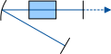
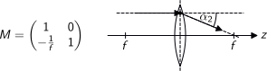
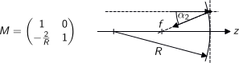
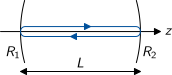
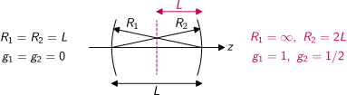
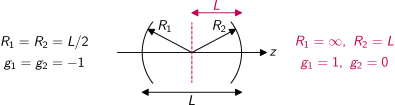
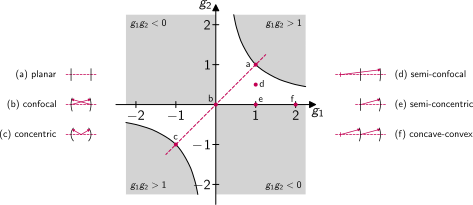

# Lasers

Laser use optical amplification to turn undirected spontaneous emission
into a directed coherent beam of optical radiation.
A minimum of three components are required for laser operation:

{width=1857px}

- An optical **gain medium** provides spontaneous emission and amplification 
- A **resonator** provides feedback to achieve coherent radiation
- A **pump** source provides the energy for the amplification process

---

# Resonator Types

The most basic type of optical resonator is the **linear resonator** with two mirrors:

{width=715px}

For practical reasons, **folded resonators** are often used:

{width=722px}

**Ring resonators** need an optical isolator to select one travelling wave:

{width=663px}

---

# Ray Optics

The concepts of ray optics are applicable for situations in which all geometrical dimensions like

- beam diameter
- aperture size of optical elements
- radius of curvature of lenses and mirrors

are much larger than the wavelength.
An important special case are the conditions for the **paraxial approximation**:

- existence of an optical axis
- aperture sizes much larger than beam diameters
- small propagation angles: $\alpha=\tan\alpha=\sin\alpha$

Examples: $\qty{1}{\percent}$ deviation for $\alpha=\qty{10}{\degree}$ and $\qty{4}{\percent}$ deviation for $\qty{20}{\degree}$.

---

# Transfer Matrix

The transfer matrix or ABCD matrix concept is a very useful tool for the ray tracing analysis of paraxial optical systems.
An optical ray along the optical axis is described by a two-element vector

{width=1476px}

with the distance $r$ of the starting point from the optical axis $z$ and its propagation angle $\alpha$ with respect to the optical axis.
A **linear optical** system converts an input ray $\mathbf{r}_1$ into an output ray $\mathbf{r}_2$ by a linear transformation
$$
\mathbf{r}_2 = M\, \mathbf{r}_1
$$
The $2\times2$ transfer matrix $M$ describes the optical system completely in the **paraxial approximation**.
Breaking the optical functionality of the system into $k$ more basic elements is equivalent to splitting $M$ into a product of transfer matrices of all elements:
$$
M = M_k \cdots M_2 \cdot M_1
$$

---

# Optical Elements

Ray **propagation** in an homogenous medium is the most fundamental optical functionality.
It is described by the transfer matrix

{width=1670px}

with $L=z_2-z_1$. Example calculation:
$$
\begin{pmatrix}
1 & L \\ 0 & 1
\end{pmatrix}
\begin{pmatrix}
r_1 \\ \alpha
\end{pmatrix}
=
\begin{pmatrix}
r_1+L\alpha \\ \alpha
\end{pmatrix}
=
\begin{pmatrix}
r_2 \\ \alpha
\end{pmatrix}
$$

---

# Optical Elements (cont.)

Refraction is taking place at an **interface** between two materials with the refractive indices $n_1$ and $n_2$:

{width=1709px}

The example calculation shows how Snell's law in paraxial approximation applies:
$$
\begin{pmatrix}
1 & 0 \\ 0 & \frac{n_1}{n_2}
\end{pmatrix}
\begin{pmatrix}
r \\ \alpha_1
\end{pmatrix}
=
\begin{pmatrix}
r \\ \frac{n_1\alpha_1}{n_2}
\end{pmatrix}
=
\begin{pmatrix}
r \\ \alpha_2
\end{pmatrix}
$$

---

# Optical Elements (cont.)

The transfer matrix of a thin **spherical lens** with negligible thickness is

{width=1744px}

with the focal length $f$. The example calculation gives
$$
\begin{pmatrix}
1 & 0 \\ -\frac{1}{f} & 1
\end{pmatrix}
\begin{pmatrix}
r \\ \alpha_1
\end{pmatrix}
=
\begin{pmatrix}
r \\ \alpha_1 - \frac{r}{f}
\end{pmatrix}
=
\begin{pmatrix}
r \\ \alpha_2
\end{pmatrix}
$$
Note that a thick lens is combined by two partial lenses and a propagation section between the two principal planes.

---

# Optical Elements (cont.)

A **spherical mirror** is handled identical to a spherical lens.
Its focal length $f=R/2$ is defined by the radius of curvature $R$
with the sign convention $R>0$ for convex and $R<0$ for concave surfaces:

{width=1757px}

Note that the mirror flips the direction of the optical axis,
which is not apparent from the transfer matrix itself.
This is of special importance for more complex optical systems with tilted elements which result in a folded optical axis. Note also that the transfer matrix of a flat mirror with $R=\infty$ is the identity matrix
$$
M = 
\begin{pmatrix}
1 & 0 \\ 0 & 1
\end{pmatrix}
$$

---

# Linear Resonator

It turns out that the transfer matrix approach is not only applicable to optical rays but also to Gaussian beams.
This allows to use it for a stability analysis of optical resonators.
We investigate a simple linear resonator consisting of two spherical mirrors with radii of curvature $R_1$ and $R_2$ centred on the optical axis at a distance $L$:

{width=1016px}

The full round-trip of the beam inside the resonator comprises a reflection $M_m^{(i)}$ at each of the two spherical mirrors $i=1,2$ and two propagations $M_L$ over the resonator length.
For symmetry reasons it is favourable to split the reflection at each mirror into a product of two half reflections $M_m^{(i)}=M_i \cdot M_i$:
$$
M_L =
\begin{pmatrix}
1 & L \\ 0 & 1
\end{pmatrix}
\qquad
M_i =
\begin{pmatrix}
1 & L \\ -\frac{1}{R_i} & 1
\end{pmatrix}
$$

---

# Linear Resonator (cont.)

The transfer matrix for the full round-trip is then a six-fold matrix product.
Due to our half-reflection approach it splits into two parts, transposed to each other:
$$
M = (M_1 \cdot M_L \cdot M_2) \cdot (M_2 \cdot M_L \cdot M_1)
= M_{12} \cdot M_{21} = M_{12} \cdot M_{12}^T
$$
By inserting the propagation and half reflection matrices, we obtain the matrix
$$
M =
\begin{pmatrix}
2 g_1 g_2-1 & 2 L g_1 \\
\frac{2 g_2}{L}(g_1 g_2 - 1) & 2 g_1 g_2-1
\end{pmatrix}
$$
with the two resonator parameters
$$
g_i = 1 - \frac{L}{R_i}
$$

---

# Eigenvalue Equation

In order to analyse the stability of the resonator, we solve the eigenvalue equation of the round-trip matrix $M$ for complex eigenvalues $\eta$ and eigenvectors $\mathbf{r}$:
\begin{gather*}
M \mathbf{r} = \eta\, \mathbf{r} \\
(M - \eta\, \mathbb{1})\, \mathbf{r} = 0
\end{gather*}
With the trace $\tr(M) = 2(2 g_1 g_2 - 1) = 2g$ and the determinant $\det(M) = 1$ this leads to the characteristic equation
\begin{align*}
\eta^2 - \eta\,\tr(M) + \det(M) & = 0 \\
\eta^2 - 2g\,\eta + 1 & = 0
\end{align*}
The two solutions of this quadratic equation are
$$
\eta_\pm = g \pm \sqrt{g^2-1}
$$

---

# Eigenvalue Equation (cont.)

*Solution 1:* The case $|g|>1$ results in $|\eta_\pm|>1$, which means that the ray vector magnitude increases with each round-trip. This is the definition of an **unstable resonator**.

*Solution 2:* In the case $|g|<1$ we can set $g=\cos\phi$, which results in the eigenvalues
$$
\eta_\pm = g \pm i\sqrt{1 - g^2}
= \cos\phi \pm i\sin\phi
= \mathrm{e}^{\pm i \phi}
$$
The magnitude of these eigenvalues is $|\eta_\pm|=1$, which means that the ray permanently stays inside the resonator.
This solution thus describes a **stable resonator**.

Due to the fact that the eigenvalues are complex conjugates of each other, we can always construct **real eigenvectors**, which stay real after a resonator round-trip:
\begin{gather*}
\mathbf{r}_0 = c_+\mathbf{r}_+ + c_-\mathbf{r}_- \\
\mathbf{r}_1 = M\,\mathbf{r}_0 = \eta_+c_+\mathbf{r}_+ + \eta_-c_-\mathbf{r}_-
\end{gather*}

---

# Stable Resonators

With $g=2 g_1 g_2 - 1$ the stability condition $|g|<1$ is equivalent to
$$
0 \le g_1 g_2 \le 1
$$
A detailed analysis of this condition reveals three different stable configurations of the linear optical resonator:

{width=2781px}

---

# Stable Resonators (cont.)

The **Fabry-Perot resonator** configuration uses two flat mirrors.
It theoretically results in an infinitely large diameter of the Gaussian beam,
which is limited by the free aperture of the mirrors in practice.

{width=1594px}

With $g_1g_2=1$ it is an example for a resonator at the edge of the stability region.
Each ray with a propagation angle even slightly different from $\alpha=0$ will leave the resonator. 

---

# Stable Resonators (cont.)

In a **confocal resonator** the centre of the curvature sphere of each mirror is located at the surface centre of the other mirror.
This configuration minimises the beam diameter at the mirrors:

{width=2263px}

With $g_1g_2=0$ it is also an example for a resonator at the edge of the stability region.

The confocal resonator can be converted into a stable **semi-confocal** resonator with $g_1g_2=1/2$
by placing a flat mirror in the centre of the resonator.

---

# Stable Resonators (cont.)

In a **concentric resonator** the centre of the curvature spheres of both mirrors are located in the centre of the resonator.
This configuration minimises the beam diameter in the centre of the resonator:

{width=2333px}

With $g_1g_2=1$ it is again an example for a resonator at the edge of the stability region.

The confocal resonator can be converted into a **semi-concentric** resonator with $g_1g_2=0$
by placing a flat mirror in the centre of the resonator.

---

# Stability Diagram

The stability diagram of linear resonators is a graphical representation of the stability region for linear resonators.

{width=2799px}

