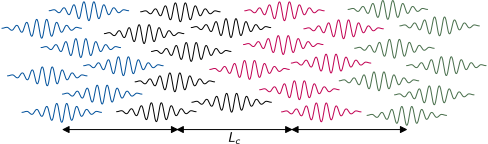
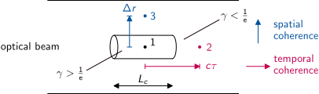
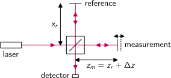
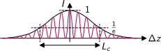
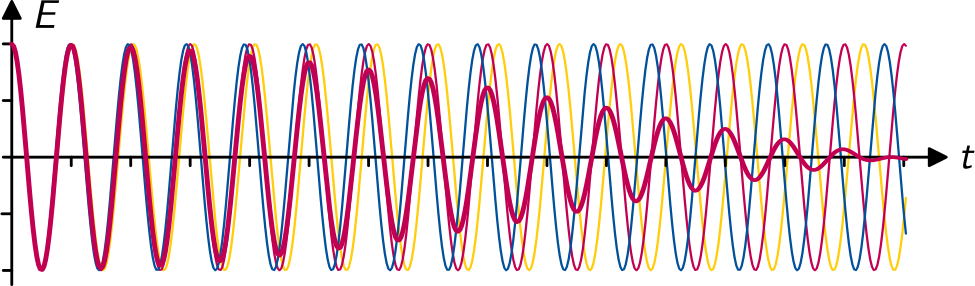
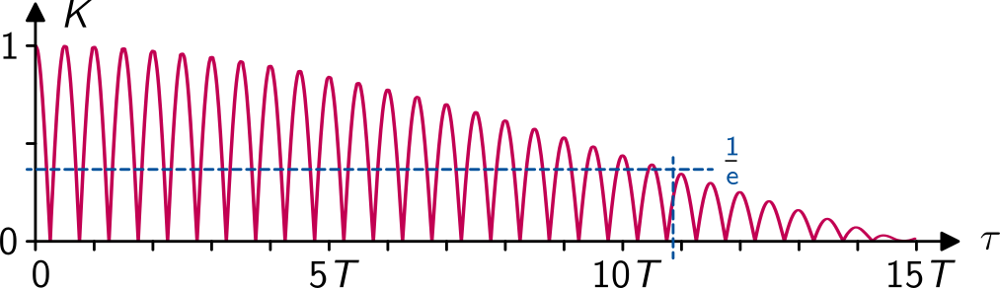
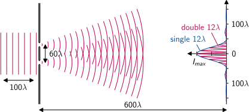
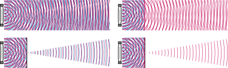

# Coherence

**Origin:** The Latin verb *cohaerere* = to stick together.

A wave field is called coherent, when it behaves identical at every place and time except of a certain phase shift.
Coherence is the foundation of all **interference** phenomena.

The photons in a laser beam can be described as a stream of wave packets.
Each initial seed photon was spontaneously emitted with an arbitrary phase.
The subsequent amplification by **stimulated emission** keeps this phase.

There are two kinds of coherence

- **temporal coherence** along the optical axis $z$
- **spatial coherence** perpendicular to the axis in $x$ and $y$ direction

---

# Coherence (cont.)

The average distance between the coherent sets of photons originating from the same seed is called **coherence length** $L_c$:

{width=2883px}

---

# Superposition

The frequency and wavelength of all photons of a laser beam is (almost) the same. Superposition of two plane waves from two sets with phase difference $\Delta\varphi$:
$$
E = \frac12 \left[\left(E_1+E_2\mathrm{e}^{i\Delta\varphi} \right) \mathrm{e}^{i(\omega t-\mathbf{k}\mathbf{r})}
+ \left(E_1+E_2\mathrm{e}^{-i\Delta\varphi} \right) \mathrm{e}^{-i(\omega t-\mathbf{k}\mathbf{r})}\right]
$$
The phase difference results in an interference term in the equation for the total intensity
\begin{align*}
I &= \frac{1}{2Z}|E|^2 \\
&= \frac{1}{2Z} (E_1^2 + E_2^2 + 2 E_1E_2\cos\Delta\varphi) \\
&= I_1 + I_2 + 2 \sqrt{I_1I_2} \cos\Delta\varphi
\end{align*}

---

# Coherence Factor

We introduce the coherence factor $\gamma$ and the **contrast function** $K$:
$$
K = \frac{2\sqrt{I_1I_2}}{I_1+I_2}\, \gamma
$$
With the total incoherent intensity $I_0=I_1+I_2$ we get the interference equation
$$
I = I_0 (1 + K \cos\Delta\varphi)
$$
The coherence factor allows to describe the general case of **partial coherence**

- incoherent: $\gamma = 0$
- partially coherent: $0 < \gamma < 1$
- coherent: $\gamma = 1$

---

# Interference Pattern

The general phase shift between two waves may result from either a temporal offset $\tau$ and/or a spatial offset $\Delta\mathbf{r}=\mathbf{r}_2-\mathbf{r}_1$:
$$
\Delta\varphi = \omega\tau - k\Delta\mathbf{r}
$$
For two waves with **equal intensity** $I_1=I_2=I_0/2$ the contrast function reduces to $K=\gamma$.
The cosine function in the interference equation $I = I_0 (1 + \gamma\cos\Delta\varphi)$
leads to the characteristic oscillation of interference patterns with local minima and maxima:
\begin{align*}
I_{min} &= I_0 (1-\gamma) \\
I_{max} &= I_0 (1+\gamma)
\end{align*}
This allows to determine the local coherence factor from the measurement of the interference pattern $I(\tau,\Delta\mathbf{r})$:
$$
\gamma = \frac{I_{max}-I_{min}}{I_{max}+I_{min}}
$$

---

# Coherence Volume

The self-superposition of an optical beam without temporal and spatial offset
always results in a maximum of $\gamma=1$ even for otherwise incoherent beams. 
Aside this point, the coherence factor decreases for increasing $\tau$ or $\Delta r$.
The value $\gamma = 1/\mathrm{e}$ defines a **coherence volume**.
In axial direction its size is called **coherence length** $L_c$ or **coherence time** $t_c=L_c/c$:

{width=2403px}

---

# Correlation Function

The mathematical description of coherence uses the cross-correlation function:
$$
\Gamma_{12}(\tau) = \langle E(\mathbf{r}_1, t)\, E^\ast(\mathbf{r}_2, t+\tau) \rangle
= \lim_{T\to\infty} \frac{1}{T}\!\!\! \int\limits_{-T/2}^{+T/2}\!\!\! E(\mathbf{r}_1, t)\, E^\ast(\mathbf{r}_2, t+\tau) dt
= 2Z \sqrt{I_1 I_2}\, \gamma(\tau)
$$
The spatio-temporal contrast function is defined as normalised cross-correlation:
$$
K_{12}(\tau) = \left| \frac{2\Gamma_{12}(\tau)}{\Gamma_{11}(0)+\Gamma_{22}(0)} \right|
= \frac{2\sqrt{I_1I_2}}{I_1+I_2}\, \gamma(\tau)
$$
with the maxima of the auto-correlation functions
$$
\Gamma_{11}(0) = 2Z\, I_1 \qquad\qquad \Gamma_{22}(0) = 2Z\, I_2
$$

---

# Correlation Function (cont.)

The case of pure temporal coherence is given for $\mathbf{r}_1=\mathbf{r}_2$. The contrast function is a normalised auto-correlation function then:
$$
K(\tau) = \left| \frac{\Gamma(\tau)}{\Gamma(0)} \right|
$$

Pure spatial coherence is given for $\tau = 0$. The contrast function is the temporal maximum of the normalised cross-correlation function in this case:
$$
K_{12} = \left| \frac{2\Gamma_{12}}{\Gamma_{11}+\Gamma_{22}} \right|
$$

---

# Temporal Coherence

A **Michelson interferometer** can be used to measure the coherence length of a laser:

{width=1681px}

Interference pattern of the interferometer:

{width=1369px}

---

# Wiener-Khinchin Theorem

The Wiener-Khinchin theorem states that the **power spectral density** of a statistical process is identical to the Fourier transform of its **autocorrelation function**:
$$
S(\omega) = \int\limits_{-\infty}^{+\infty}\!\! \Gamma(\tau)\, \mathrm{e}^{-i\omega t} d\tau
$$
with the autocorrelation function
$$
\Gamma(\tau) = \langle E(t) E^\ast(t+\tau) \rangle
$$
From this follows the relationship between the spectral linewidth $\Delta\lambda$ of an optical beam
and its coherence length $L_c$.
Due to $\lambda=c/\nu$ this leads also to a simple relationship between the spectral bandwidth $\Delta\nu$
of a signal and the coherence time $t_c$:
$$
L_c = \frac{\lambda^2}{\Delta\lambda}
\qquad\qquad
t_c = \frac{1}{\Delta\nu}
$$

---

# Spectral Bandwidth

Superposition of waves with three different frequencies around a centre frequency $\nu_0$
and with the spectral bandwidth $\Delta\nu=0.09\,\nu_0$:

{width=2031px}

The respective contrast function $K(\tau) = |\Gamma(\tau)/\Gamma(0)|$ is

{width=2111px}

---

# Spectral Bandwidth (cont.)

A list of optical radiation sources with increasing coherence:

| Source                | $\lambda$                | $\Delta\lambda$ | $\Delta\nu$    | $L_c$                   | $t_c$                    |
|-----------------------|--------------------------|-----------------|----------------|-------------------------|--------------------------|
| white light           | \qtyrange{400}{800}{nm}  | \qty{400}{nm}   | \qty{400}{THz} | \qty{800}{nm}           | \qty{2,5}{fs}            |
| red LED	            | \qty{640}{nm}            | \qty{40}{nm}    | \qty{30}{THz}  | \qty{10}{\micro\metre}  | \qty{30}{fs}             |
| FP diode laser        | \qty{1.3}{\micro\metre}  | \qty{4}{nm}     | \qty{710}{GHz} | \qty{420}{\micro\metre} | \qty{1.4}{ps}            |
| sodium-vapor lamp     | \qty{589}{nm}            | \qty{600}{pm}   | \qty{500}{GHz} | \qty{600}{\micro\metre} | \qty{2}{ps}              |
| HeNe laser	        | \qty{633}{nm}            | \qty{2}{pm}     | \qty{1.5}{GHz} | \qty{200}{mm}           | \qty{670}{ps}            |
| DFB diode laser       | \qty{1.3}{\micro\metre}  | \qty{100}{fm}   | \qty{20}{MHz}  | \qty{15}{m}             | \qty{50}{ns}             |
| stabilised HeNe laser | \qty{633}{nm}            | \qty{200}{am}   | \qty{150}{kHz} | \qty{2}{km}             | \qty{7}{\micro\second}   |
| DFB fibre laser       | \qty{1.55}{\micro\metre} | \qty{24}{am}    | \qty{3}{kHz}   | \qty{100}{km}           | \qty{330}{\micro\second} |

---

# Spatial Coherence

Young's **double slit experiment** can be used to measure the spatial coherence of a laser:

{width=2467px}

The maximum intensity $I_{max}$ decreases with increasing slit distance and reaches $1/\mathrm{e}$ of its single slit value for the spatial coherence length.

---

# van Cittert–Zernike Theorem

The van Cittert–Zernike theorem states that the **angular intensity distribution** of a source is identical to the spatial Fourier transform of its **cross-correlation function**:
$$
I(k_x,k_y) = \iint\limits_{-\infty}^{+\infty}\!\! \Gamma_{12}\, \mathrm{e}^{i(k_xx+k_yy)} dx\,dy
$$
with the cross-correlation function
$$
\Gamma_{12} = \langle E(\mathbf{r}_1)\, E^\ast(\mathbf{r}_2) \rangle
$$
and $x=x_2-x_1$ and $y=y_2-y_1$. From this follows a condition for spatial coherence of a light source in the far field:
$$
2d \sin\alpha \ll \lambda
$$
with the source aperture width $d$ and half exit angle $\alpha$.

---

# Coherence Filters

Generating coherent light from an incoherent source (incandescent bulb):

{width=2680px}

- **Incoherence** (no filter): many wavelengths, many directions
- **Spatially coherence** (pinhole): many wavelengths, single direction
- **Temporal coherence** (spectral filter): single wavelength, many directions
- **Full coherence** (both filters): single wavelength, single direction

