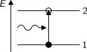
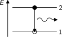
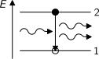
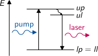
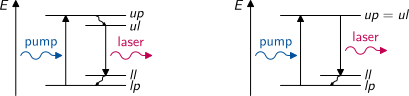
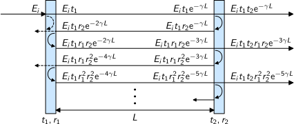
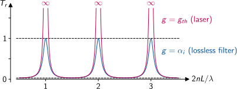
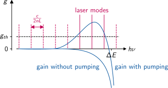

# Interactions of Light and Matter

There are **three fundamental interactions** of light and matter.
The energy of photons in the visible range determines that this involves excitation or relaxation processes within the electron system of atoms, ions or molecules.

For each system the probability for a transition is **independent** of the state of the neighbour systems.
In case of gases a system may thus involve individual atoms, but in denser matter the electron wave functions of atoms overlap.
The relevant systems are molecules then or the quasi-free electrons in the bands of solid state materials.

The basic description of the interaction processes uses simplified systems with just two energy levels and **population densities** $N_1$ and $N_2$.
The total density of states is thus $N=N_1+N_2$.
More complex energy level or energy band systems increase the mathematical complexity, but do not introduce other fundamental concepts.

Only photons with an energy $h\nu=E_2-E_1$ which matches exactly the gap between both states are involved in the processes.
The respective **photon density** is $n$.

---

# Absorption of Light

The **absorption** process takes place in essentially every material, because usually most systems are in the ground state:

{width=748px}

Due to the independence of the systems, the variation rate of the lower state 1 is proportional only to its population density $N_1$ as well as the photon density $n$:
$$
\frac{dN_1}{dt} = -B_{12} N_1 n
$$
with the Einstein coefficient for absorption $B_{12}$.

---

# Spontaneous Emission of Light

There are two options for the relaxation of excited states.
One is the **spontaneous emission** of a photon:

{width=748px}

The variation rate of the lower state 1 is proportional only to the population density $N_2$ of the excited state:
$$
\frac{dN_1}{dt} = A_{12} N_2
$$
with the Einstein coefficient for spontaneous emission $A_{21}$.
Since there is no dependency on the photon density, this this transition is not seen as inverse of the absorption process.

---

# Stimulated Emission of Light

The second relaxation process is triggered by a photon accidentally meeting an excited system and results in the **stimulated emission** of another photon:

{width=748px}
 
The variation rate of the lower state 1 is proportional to the population density $N_2$ of the excited state as well as the photon density $n$:
$$
\frac{dN_1}{dt} = B_{21} N_2 n
$$
with the Einstein coefficient for stimulated emission $B_{21}$.
This process, is inverse to absorption.
Due to the conservation of energy and momentum, both photons share the same frequency, the same direction and the same phase.
They are thus **coherent**.

---

# Rate Equation

All three interaction processes are simultaneously active.
The total rate equation is therefore
$$
\frac{dN_1}{dt} = -N_1 B_{12} n + N_2 B_{21} n + N_2 A_{21}
$$
This equation is valid under any condition.
We use the special case of a thermal equilibrium to determine relationships between the Einstein coefficients. According to Boltzmann and Planck, we have:
$$
\frac{N_2}{N_1} = \frac{g_2}{g_1} \mathrm{e}^{-\frac{h\nu}{kT}}
\qquad
n = \frac{8\pi h\nu^3}{c^3} \frac{1}{\mathrm{e}^{\frac{h\nu}{kT}-1}}
$$
with the Boltzmann constant $k=\qty{1.38e-23}{J/K}$. We obtain:
$$
g_1 B_{12} = g_2 B_{21}
\qquad
A_{21} = \frac{8\pi \nu^3}{c^3}B_{21}
$$

---

# Laser Action

Above laser threshold, the influence of spontaneous emission on the rate equation can be neglected.
The steady state condition for a running laser is therefore described by
\begin{gather*}
\frac{dN_1}{dt} = -N_1 B_{12} n + N_2 B_{21} n \stackrel{!}{=} 0 \\
N_2 B_{21} = N_1 B_{12} \\
\frac{N_2}{N_1} = \frac{g_2}{g_1}
\end{gather*}
For thermal equilibrium Boltzmann's law predicts
$$
\frac{N_2}{N_1} < \frac{g_2}{g_1}
$$
because $\exp(-h\nu/kT)<1$.
We conclude that there is no optical gain in thermal equilibrium.
Optical gain requires pumping.

---

# Three-Level Laser

Due to the relationship between the Einstein coefficients, 
laser action with optical pumping is impossible in a system with just two energy levels. 
Pumping must take place at a wavelength different from the laser transition.
The simplest case is a three-level system in which the upper pump level $up$ is close to the upper laser level $ul$.
This allows for a fast non-radiative relaxation $up \to ul$:

{width=985px}

The common lower level $lp=ll$ requires strong pumping to start laser action by population inversion.
As soon as the laser is running, the rate equation fixes $N_{ul}=N_{ll}$.
Strong reabsorption of laser photons therefore makes three-level lasers inefficient.

---

# Four-Level Laser

In a four-level laser the lower laser level is separated from the lower pump level, which is always the ground state of the laser.
The two possible configurations are:

{width=2418px}

Population inversion $N_{ul}>N_{ll}$ is easily achieved even with low pump power.
Each system reaching the lower laser level, immediately relaxes non-radiatively to the ground state,
due to the short distance between the two lower levels.
This suppresses the reabsorption of laser photons and makes four-level lasers very efficient. 

**Note:** The term *four-level laser* is misleading.
Not the number of level is its characteristic, but the splitting of lower pump and laser levels.

---

# Multipath Interference

We follow an electrical field propagating in a resonator with complex wavenumber $\gamma$ 
taking intrinsic loss into account by $\alpha_i$ and optical gain by $g$:
$$
E = E_i\mathrm{e}^{-\gamma z}
\qquad
\gamma = \frac{\alpha_i-g}{2} + ikn
$$
{width=2516px}

---

# Multipath Interference (cont.)

The total output field is given as superposition of all partial fields transmitted through the second mirror:
$$
E_t = E_it_1t_2\mathrm{e}^{-\gamma L} \sum_{\nu=0}^{\infty} (r_1r_2\mathrm{e}^{-2\gamma L})^\nu
$$
The infinite sum resembles a geometric series which allows us to give a closed expression for the field transmission of the resonator:
$$
t_r = \frac{E_t}{E_i} =  \frac{t_1t_2\mathrm{e}^{-\gamma L}}{1-r_1r_2\mathrm{e}^{-2\gamma L}}
$$

**Note:** This result is valid only for small fields.
It describes the conditions for the laser threshold.
As soon as the laser is running, the fixed initial gain $g$ becomes a function of the intensity,
invalidating the result.

---

# Laser Threshold and Modes

The laser threshold is reached, when the denominator of $t_r$ becomes zero:
$$
r_1 r_2 \mathrm{e}^{-2\gamma L} =
r_1 r_2 \mathrm{e}^{-(\alpha_i-g) L} \cdot \mathrm{e}^{-iknL} = 1
$$
The squared magnitude condition of this complex equality delivers the **threshold gain**, which is equal to the sum of the intrinsic losses and the mirror losses:
\begin{gather*}
R_1 R_2 \mathrm{e}^{-2(\alpha_i -g) L} = 1 \\
g_{th} = \alpha_i-\frac{\ln(R_1R_2)}{2L}
\end{gather*}
The phase condition of the complex equality delivers the **longitudinal modes** of the resonator
with equidistant frequency spacing:
\begin{align*}
knL = 2\pi\,m &\qquad \text{with } m=0,\pm1,\pm2,\ldots \\
\nu_m = m\,\frac{c}{2nL} &\qquad \text{with } \nu=\frac{c}{\lambda}
\end{align*}

---

# Resonator Transmission

The power transmission $T_r$ of the resonator has periodic maxima in case of constructive interference.
For a lossless resonator the transmission is one in these cases.
At the laser threshold it would be infinite for constant gain in the resonator:

{width=2385px}

---

# Laser Spectrum

Without pump power, the laser medium is transparent below the energy gap $\Delta E$.
At the energy gap, the absorption is increasing exponentially.
Pumping results in positive gain in a spectral region at the energy gap.
The laser spectrum contains all resonator modes for which the optical gain exceeds the threshold value $g_{th}$:

{width=2040px}
