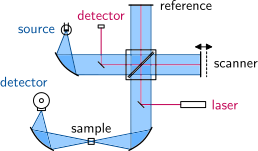
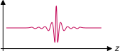
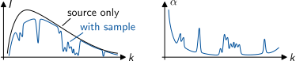
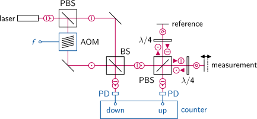
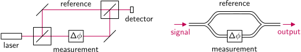
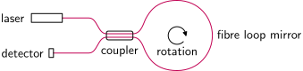
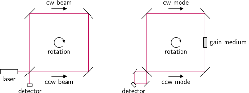

# FTIR Spectrometer

Setup of a Fourier transform infrared spectrometer with white light source:

{width=1525px}

A reference laser is used to determine the mirror position with high precision.

---

# FTIR Spectrometer (cont.)

Spatial interferogram of an FTIR spectrometer.
The location of the maximum peak marks the point of equal path lengths:

{width=1002px}

Based on the spatial phase factor $\exp(ikz)$, the Fourier transform of the interferogram delivers the wavenumber spectrum of the signal.
The difference between source and sample spectrum is used to calculate the absorption spectrum of the sample:

{width=2212px}

---

# Heterodyne Interferometer

The beat frequency $f$ between two laser beams with and without frequency shift is detected by photo diodes in a heterodyne interferometer.
With the measurement mirror at rest, the counter stops.
A moving mirror modulates the phase of the second signal which results in a changed counter value.

{width=2562px}

---

# Mach-Zehnder Interferometer

The Mach-Zehnder interferometer is a phase sensitive interferometer which uses a separate beam splitter and combiner.
Symmetric conditions the signals from both arms reach the output without phase shift, resulting in constructive interference.
A disturbance in one arm results in destructive interference for the output signal.

{width=3009px}

**Note:** The common-mode suppression is important for sensor applications.
Mach-Zehnder structures are very common in planar integrated optical systems based on single-mode waveguides.

---

# Sagnac Interferometer

The signals travelling  clockwise and counter-clockwise in the fibre loop reach the detector at the same time,
when the Sagnac fibre interferometer is at rest.
However, there is always a $\pi/2$ phase difference between the two signals leaving the fibre coupler.
In case of a $\qty{50}{\percent}$ coupler this leads to destructive interference on the detector.
An **angular velocity** results in a phase difference proportional to the rotational speed.

{width=2002px}

**Note:** A Sagnac interferometer in free space optics can use a conventional beam splitter,
because the reflection at an interface to a medium with higher index also results in the required $\pi/2$ phase shift.

---

# Laser Gyroscope

The clockwise and counter-clockwise travelling modes in a ring resonator result in a standing wave.
The oscillation nodes are fixed in space.
In the overlapping zone behind the partially reflecting output coupler OC these modes generate a fringe pattern recorded by an optical detector.
The fringes move with the rotation of the resonator proportional to its **angular position**.

{width=1621px}

---

# Comparison

- **Sagnac Interferometer:** Passive ring $\to$ measurement of angular velocity
- **Laser Gyroscope:** Active ring $\to$ measurement of angular position

{width=3010px}
